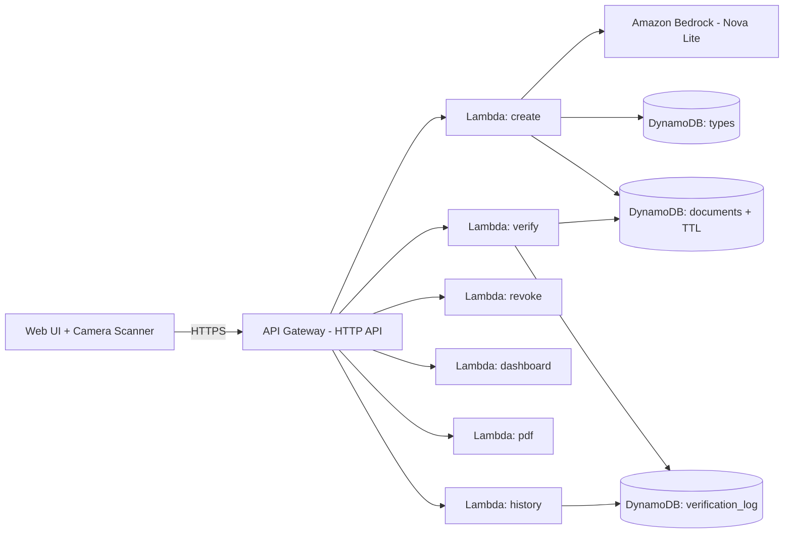

# TrustMint

**A universal forge-proofing engine.**
_If it doesn't exist until you need it, it can't be faked before you need it._

Built for **First Commit** (Bharat Builds Tour, WeMakeDevs x AWS) by Team METIS.

---

## The problem

India has a forgery problem across every sector. Prescriptions for controlled
drugs get reused and photocopied. Degree certificates are faked at scale. Tickets
and ID cards get duplicated. The root cause is the same everywhere: documents
exist as static files or templates that can be copied.

## The idea — Just-In-Time documents

TrustMint mints a document only at the moment it's needed. Each one gets a unique
cryptographic signature and QR, is stored with an expiry, and can be verified only
under its own rules (one-time use, or time-limited). Once used, expired, or revoked,
it's dead. Nothing pre-exists, so nothing can be forged ahead of time.

The key design choice: **one generic engine, document types as configuration.**
A prescription, certificate, ticket, invoice, event pass, or ID card is just a row
in a registry — no new code. Add a type, and the whole system (issue, verify, PDF,
scan, AI check) handles it instantly.

## Architecture



## Built on AWS

| Service | Role |
|---|---|
| AWS Lambda | All backend logic (6 functions) |
| API Gateway (HTTP API) | REST endpoints + request throttling |
| DynamoDB | Types registry, documents (native TTL expiry), audit log |
| Amazon Bedrock (Nova Lite) | AI checks — drug interactions, certificate validation |
| AWS SAM | Infrastructure as code |
| AWS Amplify | Frontend hosting |

## Features

- Generic JIT engine — issue, verify, revoke, auto-expire (DynamoDB TTL)
- 6 document types from config alone (prescription, certificate, ticket, invoice, event pass, ID card)
- **AI safety checks** via Bedrock — flags dangerous drug interactions, validates certificate content
- **HMAC signing** — tamper-evident; altering a stored record fails verification
- One-time-use enforcement and time-limited validity, per type
- **Fraud-attempts metric** — counts blocked reuse/forgery attempts
- **Full audit trail** — every verification logged and queryable
- **PDF export** with embedded QR
- **Live camera QR scanner**
- API rate limiting

## API

| Method | Path | Purpose |
|---|---|---|
| POST | /create | Mint a document `{type_id, payload}` |
| POST | /verify | Verify a QR `{qr_hash}` -> valid / already_used / revoked / expired / tampered / invalid |
| POST | /revoke | Cancel a document `{doc_id}` |
| GET | /dashboard | Counts incl. fraud_attempts |
| GET | /pdf?doc_id= | Download a document PDF |
| GET | /history?doc_id= | Verification timeline |

## Run it

```bash
sam build && sam deploy --guided     # deploy backend
python3 seed/gen_secret.py           # provision signing secret (once)
python3 seed/load_all.py             # load document types
```

Frontend: open `web/index.html` (issuer/verifier) or `web/scan.html` (camera scanner).

## What we learned

Serverless from scratch in a weekend — AWS Lambda, DynamoDB single-table design and
TTL, API Gateway, Amazon Bedrock via the Converse API, HMAC-based integrity, and
SAM deployments. None of the team had touched AWS before this hackathon.

## AI tools used

Development assisted by Claude (Anthropic). Document AI checks run on Amazon Bedrock (Nova Lite).

## Team METIS

Dev Dayakar Bonigala (engine + lead) · Yakkala Manasa (frontend) · Praveen Chandika (types + AI + demo)

## Demo access

Sign in to the live app with any of these demo accounts:

| Role | Username | Password |
|---|---|---|
| Doctor | doctor01 | Doctor@123 |
| Pharmacist | pharmacist01 | Pharmacist@123 |
| University Issuer | university01 | Issuer@123 |
| Event Organizer | organizer01 | Organizer@123 |

Doctors and issuers create documents; pharmacists and verifiers check them.
